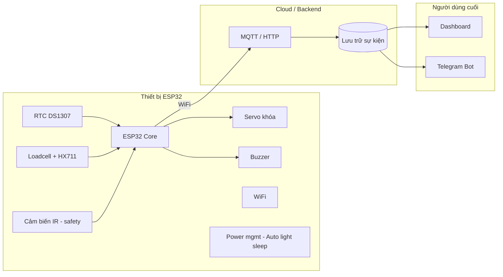
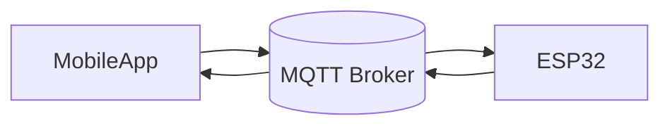

# SmartPilBox

**Hộp thuốc thông minh hỗ trợ y tế từ xa** — dự án IoT cho học phần *From Sensor to User* (Master M1 ICT), với hướng mở rộng *Security and Ethics for Data*.

---

## Mục lục

- [Tổng quan](#tổng-quan)
- [Vấn đề & giải pháp](#vấn-đề--giải-pháp)
- [Kiến trúc hệ thống](#kiến-trúc-hệ-thống)
- [Ứng dụng người dùng (Prototype MVP)](#ứng-dụng-người-dùng-prototype-mvp)
- [Phần cứng](#phần-cứng)
- [Sơ đồ chân ESP32](#sơ-đồ-chân-esp32)
- [Luồng vận hành](#luồng-vận-hành)
- [Lắp ráp cơ khí](#lắp-ráp-cơ-khí)
- [Phần mềm & cấu trúc repo](#phần-mềm--cấu-trúc-repo)
- [Cài đặt & chạy thử](#cài-đặt--chạy-thử)
- [An ninh & đạo đức dữ liệu](#an-ninh--đạo-đức-dữ-liệu)

---

## Tổng quan

**SmartPilBox** (Smart Pillbox / Medication Tracker) là hộp đựng thuốc IoT giúp người cao tuổi uống thuốc đúng giờ, đúng liều, đồng thời cho phép người thân hoặc nhân viên y tế **giám sát từ xa** qua dữ liệu cảm biến thời gian thực.

Hệ thống (phiên bản code hiện tại) kết hợp:

- **Khóa cơ học** (Servo) — chỉ mở nắp khi đến giờ, hạn chế uống quá liều hoặc trẻ em mở nhầm
- **Cân tải trọng** (Loadcell + HX711) — đo khối lượng trước/sau để xác nhận đã lấy thuốc
- **Cảm biến hồng ngoại IR** — kiểm tra an toàn khi đóng khóa (tránh kẹt)
- **RTC DS1307** — chạy lịch theo thời gian thực kể cả khi mất WiFi
- **Buzzer** — cảnh báo uống thuốc (non-blocking)
- **MQTT (PubSubClient)** — nhận lịch uống thuốc từ app/broker và gửi trạng thái lên lại

> **Trạng thái dự án:** Đang phát triển — firmware đã có FSM điều khiển (RTC + Servo + Buzzer + HX711 + IR + MQTT) trong `SmartPilBox_embed/`. OLED/DHT11/Dashboard mở rộng theo lộ trình nhóm.

---

## Vấn đề & giải pháp

| Thách thức | Cách SmartPilBox xử lý |
|------------|-------------------------|
| Quên uống thuốc (Alzheimer, trí nhớ suy giảm) | Buzzer + OLED + mở khóa đúng giờ (RTC) |
| Uống quá liều (double-dosing) | Khóa nắp; chỉ mở theo lịch hoặc nút dự phòng |
| Người thân ở xa, khó giám sát | Đẩy trạng thái (thời gian, mở/đóng, khối lượng) lên Cloud / Telegram |
| Chỉ mở nắp mà không lấy thuốc | So sánh khối lượng trước/sau; cảnh báo nếu Δm ≈ 0 |

---

## Kiến trúc hệ thống



**Luồng dữ liệu (*From Sensor to User*):**  
Cảm biến → ESP32 (xử lý & quyết định) → mạng → Cloud → Dashboard / Telegram cho người giám hộ.

---

## Ứng dụng người dùng (Prototype MVP)

Trong giai đoạn prototype (1–2 tuần), ứng dụng chỉ tập trung vào các chức năng tối thiểu để chứng minh hệ thống SmartPilBox hoạt động hoàn chỉnh.

Mục tiêu chính:
- cài lịch uống thuốc,
- gửi lịch sang ESP32 qua MQTT,
- nhận trạng thái realtime từ ESP32,
- hiển thị người dùng đã uống thuốc hay chưa.

Hệ thống sử dụng MQTT để giao tiếp realtime giữa ứng dụng và ESP32.

---

### Kiến trúc hệ thống



### Luồng hoạt động

1. Người dùng nhập giờ uống thuốc trên app.
2. App publish thời gian lên MQTT Broker.
3. ESP32 subscribe và cập nhật lịch uống thuốc.
4. Khi đến giờ:
   - buzzer reo,
   - servo mở khóa.
5. Sau khi xác nhận uống thuốc:
   - ESP32 publish trạng thái lên MQTT.
6. App nhận dữ liệu realtime và cập nhật giao diện.

---

### Chức năng chính của app

#### 1. Đặt lịch uống thuốc

Người dùng nhập:
- giờ,
- phút uống thuốc.

App publish MQTT message:

Topic:

```text
pillbox/set_hour
```

Payload ví dụ:

```text
8
```

và:

Topic:

```text
pillbox/set_minute
```

Payload ví dụ:

```text
30
```

ESP32 sẽ cập nhật lịch thành:

```text
08:30
```

---

#### 2. Xem trạng thái hộp thuốc

ESP32 publish trạng thái realtime lên:

Topic:

```text
pillbox/status
```

Ví dụ payload:

```text
Medicine Taken
```

hoặc:

```text
Waiting for User
```

App hiển thị trạng thái đơn giản:

```text
SMARTPILBOX

Schedule: 08:30

Current Status:
✓ Medicine Taken
```

---

#### 3. Cảnh báo đơn giản

Nếu:
- đến giờ nhưng chưa uống thuốc,
- hoặc mở hộp nhưng không có thay đổi khối lượng,

ESP32 sẽ publish trạng thái cảnh báo.

Ví dụ:

```text
Medicine Not Taken
```

App hiển thị cảnh báo màu đỏ hoặc popup đơn giản.

---

### MQTT Topics

| Topic | Publisher | Subscriber | Mục đích |
|-------|------------|-------------|----------|
| `pillbox/set_hour` | Mobile App | ESP32 | Gửi giờ uống thuốc |
| `pillbox/set_minute` | Mobile App | ESP32 | Gửi phút uống thuốc |
| `pillbox/status` | ESP32 | Mobile App | Gửi trạng thái hộp thuốc |

---

### Công nghệ đề xuất

| Thành phần | Gợi ý |
|------------|------|
| Mobile App | Flutter |
| MQTT Client | mqtt_client package |
| MQTT Broker | Mosquitto / EMQX / HiveMQ |

---

### Scope prototype

Prototype chỉ cần:
- 1 thiết bị,
- 1 người dùng,
- realtime MQTT,
- không cần database,
- không cần authentication,
- không cần backend server riêng.

Mục tiêu chính:
- chứng minh luồng IoT realtime hoạt động hoàn chỉnh từ:

```text
Sensor → ESP32 → MQTT → Mobile App
```

## Phần cứng

### Linh kiện chính

| STT | Linh kiện | Vai trò |
|-----|-----------|---------|
| 1 | **ESP32 DevKit** | Vi điều khiển, WiFi (có sẵn trong học phần) |
| 2 | **RTC DS1307** | Đồng hồ thời gian thực theo lịch uống thuốc |
| 3 | **Servo SG90** | Khóa / mở nắp hộp |
| 4 | **Loadcell + HX711** | Đo chênh lệch khối lượng để xác nhận lấy thuốc |
| 5 | **Cảm biến IR** | Kiểm tra an toàn khi đóng khóa (tránh kẹt) |
| 6 | **Buzzer** | Cảnh báo âm thanh |
| 7 | **Hộp nhựa + vách Mica** | Cơ khí, ngăn thuốc / ngăn mạch |

> **Planned / optional:** OLED I2C, DHT11 (môi trường bảo quản), dashboard/telegram nâng cao.

---

## Sơ đồ chân ESP32

Pin dưới đây được lấy trực tiếp từ `SmartPilBox_embed/src/Config.h` (code hiện tại).

| Linh kiện | Giao tiếp | GPIO | Ghi chú |
|-----------|----------|--------------|---------|
| RTC DS1307 | I2C SDA / SCL | **21** / **22** | `Wire.begin(21, 22)` |
| Servo SG90 | PWM | **18** | Điều khiển khóa hộp (`SERVO_PIN`) |
| Buzzer | Digital/PWM | **19** | `BUZZER_PIN` (buzzer non-blocking) |
| HX711 | DOUT / SCK | **4** / **5** | `HX711_DOUT_PIN`, `HX711_SCK_PIN` |
| IR sensor | Digital IN | **23** | `IR_SENSOR_PIN` |
| IR power | Power control | **12** | `IR_POWER_PIN` (bật/tắt cảm biến IR) |

---

## Luồng vận hành

Firmware hiện tại vận hành theo **Finite State Machine** (FSM) trong `PillBoxController`:

1. **IDLE** — cập nhật MQTT, đọc thời gian từ RTC; chờ đúng lịch (có thể cập nhật lịch động qua MQTT).
2. **ALARM** — bật HX711, đọc khối lượng ban đầu \(W_1\), mở khóa Servo, Buzzer bắt đầu beep.
3. **BOX_OPEN / WAIT_FOR_RETURN** — theo dõi thay đổi khối lượng để phát hiện **nhấc hộp/khay** và **đặt lại**.
4. **VERIFY_MEDICINE** — đợi cân ổn định, đọc \(W_2\), tính \(\Delta m = W_1 - W_2\):
   - Nếu \(\Delta m \ge\) ngưỡng `MEDICINE_WEIGHT_THRESHOLD` → publish trạng thái lên MQTT (`pillbox/status`) và chuyển sang đóng hộp.
   - Nếu không đạt → tiếp tục cảnh báo và quay lại trạng thái mở.
5. **BOX_CLOSING** — bật IR để kiểm tra an toàn, khóa Servo nếu không có vật cản; sau đó tắt IR và detach Servo để tiết kiệm điện.
6. **COMPLETED** — power down HX711, sẵn sàng cho chu kỳ tiếp theo.

---

## Lắp ráp cơ khí

Hộp chia **2 ngăn**: ngăn thuốc ~14×15 cm, ngăn mạch ~6×15 cm.

### Tấm cắt (Mica 2–3 mm)

| Miếng | Kích thước | Mục đích |
|-------|------------|----------|
| Vách ngăn | 14,6 × 7,6 cm | Chia hộp; gắn Servo |
| Khay thuốc | 12 × 13 cm | Đặt trên Loadcell (hở ~1 cm quanh viền) |
| Đệm Loadcell ×2 | 2 × 3 cm | Sandwich loadcell — không chạm đáy/vách |

### Thứ tự lắp (tóm tắt)

1. **Sandwich Loadcell** — đệm dưới → loadcell → đệm trên → khay thuốc; kiểm tra khay nhún, không chạm thành hộp.
2. **Vách + Servo** — rãnh ~1,2×2,3 cm trên vách; cánh Servo khóa qua lỗ trên nắp.
3. **IR** — trên vách, hướng 45° xuống khay.
4. **Nắp** — lỗ OLED 3,5×2,2 cm; lỗ nút & thoát âm Buzzer.

Chi tiết đo đạc và mẹo đi dây: xem tài liệu nội bộ `project_context.md` (không đưa lên git).

---

## Phần mềm & cấu trúc repo

```
SmartPilBox/
├── README.md                 # Tài liệu dự án (file .md duy nhất trên git)
├── .gitignore
├── project_context.md        # Báo cáo / thiết kế nội bộ (local, không push)
└── SmartPilBox_embed/        # Firmware ESP32 (PlatformIO)
    ├── platformio.ini
    ├── src/main.cpp
    ├── diagram.json          # Mô phỏng Wokwi (nếu dùng)
    └── wokwi.toml
```

| Công nghệ | Mục đích |
|-----------|----------|
| **PlatformIO** + **Arduino** | Build & upload firmware ESP32 |
| **RTClib** | Đọc / cài giờ RTC |
| **ESP32Servo** | Điều khiển khóa |
| *Dự kiến* MQTT / HTTP, Telegram Bot API | Truyền dữ liệu lên Cloud |

---

## Cài đặt & chạy thử

### Yêu cầu

- [PlatformIO](https://platformio.org/) (VS Code extension hoặc CLI)
- Board **ESP32 DOIT DevKit V1**
- Cáp USB, driver CP210/CH340

### Build & upload

```bash
cd SmartPilBox_embed
pio run -t upload
pio device monitor
```

### Cài giờ RTC (một lần)

RTC hiện dùng **DS1307** qua `RTClib`. Trong code, nếu RTC mất nguồn, firmware sẽ tự sync giờ theo thời điểm compile (`__DATE__`, `__TIME__`).

Nếu bạn muốn set giờ thủ công, chỉnh tại lớp `RTCManager` hoặc thêm đoạn `adjust(DateTime(F(__DATE__), F(__TIME__)))` theo nhu cầu và nạp **một lần**.

### Mô phỏng (tuỳ chọn)

```bash
cd SmartPilBox_embed
pio run
# Hoặc mở project trong Wokwi theo diagram.json / wokwi.toml
```

---

## An ninh & đạo đức dữ liệu

Hướng nghiên cứu cho học phần tiếp theo (không nằm trong scope firmware giai đoạn 2):

| Chủ đề | Nội dung |
|--------|----------|
| **Tính toàn vẹn** | Rủi ro MITM trên MQTT — giả trạng thái "đã uống" |
| **Kiểm soát truy cập** | TLS trên ESP32; nút cơ học fail-safe khi mất mạng |
| **Quyền riêng tư** | Dữ liệu tuân thủ uống thuốc — nhạy cảm (Nghị định 13/2023/NĐ-CP) |
| **Trách nhiệm** | Sai số Loadcell → hậu quả sức khỏe; retention policy |

---

## Giấy phép & disclaimer

Dự án học thuật — **không thay thế tư vấn y tế**. Sản phẩm prototype; cần hiệu chuẩn cân và kiểm thử trước khi dùng thực tế cho người bệnh.

---
