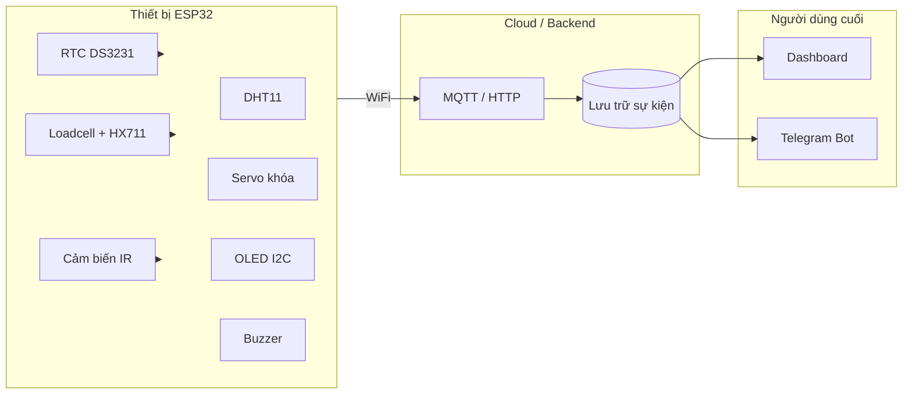

# SmartPilBox

**Hộp thuốc thông minh hỗ trợ y tế từ xa** — dự án IoT cho học phần *From Sensor to User* (Master M1 ICT), với hướng mở rộng *Security and Ethics for Data*.

---

## Mục lục

- [Tổng quan](#tổng-quan)
- [Vấn đề & giải pháp](#vấn-đề--giải-pháp)
- [Kiến trúc hệ thống](#kiến-trúc-hệ-thống)
- [Phần cứng](#phần-cứng)
- [Sơ đồ chân ESP32](#sơ-đồ-chân-esp32)
- [Luồng vận hành](#luồng-vận-hành)
- [Lắp ráp cơ khí](#lắp-ráp-cơ-khí)
- [Phần mềm & cấu trúc repo](#phần-mềm--cấu-trúc-repo)
- [Cài đặt & chạy thử](#cài-đặt--chạy-thử)
- [Kế hoạch triển khai](#kế-hoạch-triển-khai)
- [An ninh & đạo đức dữ liệu](#an-ninh--đạo-đức-dữ-liệu)
- [Nhóm thực hiện](#nhóm-thực-hiện)
- [Tài liệu nội bộ](#tài-liệu-nội-bộ)

---

## Tổng quan

**SmartPilBox** (Smart Pillbox / Medication Tracker) là hộp đựng thuốc IoT giúp người cao tuổi uống thuốc đúng giờ, đúng liều, đồng thời cho phép người thân hoặc nhân viên y tế **giám sát từ xa** qua dữ liệu cảm biến thời gian thực.

Hệ thống kết hợp:

- **Khóa cơ học** (Servo) — chỉ mở nắp khi đến giờ, hạn chế uống quá liều hoặc trẻ em mở nhầm
- **Cân tải trọng** (Loadcell + HX711) — xác nhận thuốc đã được lấy ra
- **Cảm biến hồng ngoại** — phát hiện tay thò vào khay
- **RTC** — lịch uống thuốc chính xác kể cả khi mất WiFi
- **OLED, Buzzer, DHT11** — hiển thị, cảnh báo và giám sát môi trường bảo quản

> **Trạng thái dự án:** Đang phát triển — firmware cơ bản (RTC, Servo, Buzzer) trong `SmartPilBox_embed/`; tích hợp Loadcell, IR, MQTT/Cloud theo lộ trình nhóm.

---

## Vấn đề & giải pháp

| Thách thức | Cách SmartPilBox xử lý |
|------------|-------------------------|
| Quên uống thuốc (Alzheimer, trí nhớ suy giảm) | Buzzer + OLED + mở khóa đúng giờ (RTC) |
| Uống quá liều (double-dosing) | Khóa nắp; chỉ mở theo lịch hoặc nút dự phòng |
| Người thân ở xa, khó giám sát | Đẩy trạng thái (thời gian, mở/đóng, khối lượng) lên Cloud / Telegram |
| Chỉ mở nắp mà không lấy thuốc | So sánh khối lượng trước/sau; cảnh báo nếu Δm ≈ 0 |

---

## Kiến trúc hệ thống



**Luồng dữ liệu (*From Sensor to User*):** Cảm biến → ESP32 (xử lý & quyết định) → mạng → Cloud → Dashboard / Telegram cho người giám hộ.

---

## Phần cứng

### Linh kiện chính

| STT | Linh kiện | Vai trò |
|-----|-----------|---------|
| 1 | **ESP32 DevKit** | Vi điều khiển, WiFi (có sẵn trong học phần) |
| 2 | **OLED I2C** | Hiển thị giờ, trạng thái, cảnh báo |
| 3 | **RTC DS3231** | Đồng hồ thời gian thực khi mất mạng |
| 4 | **DHT11** | Nhiệt độ / độ ẩm bảo quản thuốc |
| 5 | **Servo SG90** | Khóa / mở nắp hộp |
| 6 | **Loadcell 1 kg + HX711** | Đo khối lượng thuốc còn lại |
| 7 | **Cảm biến IR** | Phát hiện tay vào khay |
| 8 | **Buzzer** | Cảnh báo âm thanh |
| 9 | **Nút bấm** | Xác nhận / fail-safe khi mất mạng |
| 10 | **Hộp nhựa + vách Mica** | Cơ khí, ngăn thuốc / ngăn mạch |

### Dự toán chi phí bổ sung (ước tính)

| Hạng mục | Chi phí (VND) |
|----------|----------------|
| Servo SG90 | ~30.000 |
| Loadcell 1 kg + HX711 | ~10.000 |
| RTC DS3231 | ~40.000 |
| Linh kiện phụ (Buzzer, vỏ hộp, Mica…) | ~20.000 |
| **Tổng phát sinh** | **~185.000** |

*Chưa tính ESP32, OLED, DHT11, nút bấm đã có trong kit học phần.*

---

## Sơ đồ chân ESP32

| Linh kiện | Giao tiếp | GPIO (gợi ý) | Ghi chú |
|-----------|----------|--------------|---------|
| OLED | I2C SDA / SCL | **21** / **22** | Chung bus với RTC |
| RTC DS3231 | I2C SDA / SCL | **21** / **22** | Đấu song song OLED |
| HX711 | DT / SCK | **19** / **18** | Tránh chân strapping lúc boot |
| Servo SG90 | PWM | **13** | Thư viện `ESP32Servo` |
| Cảm biến IR | Digital IN | **14** | HIGH/LOW khi có vật cản |
| Buzzer | PWM / DAC | **25** | Âm thanh cảnh báo |
| Button | Digital IN | **12** | `INPUT_PULLUP` |

> Pin trong firmware hiện tại (`main.cpp`) có thể khác trong giai đoạn prototype — đồng bộ lại theo bảng trên khi hoàn thiện board.

---

## Luồng vận hành

1. **Chờ** — Servo khóa nắp; OLED hiển thị giờ (RTC) và môi trường (DHT11).
2. **Đến giờ uống thuốc** — Buzzer reo, LED nháy (nếu có), Servo mở khóa; OLED: *"Đến giờ uống thuốc"*.
3. **Người dùng mở nắp & lấy thuốc** — IR phát hiện tay; lưu khối lượng \(W_1\) trước khi lấy.
4. **Xác thực** — Sau khi đóng nắp, đợi ổn định ~3 s, đọc \(W_2\):
   - Nếu \(W_1 - W_2 > 2\,\text{g}\) (ngưỡng cấu hình) → **Đã uống đúng liều** → khóa lại → gửi Cloud *Thành công*.
   - Nếu nắp/IR có tương tác nhưng \(\Delta m \approx 0\) → **Cảnh báo: chưa lấy thuốc** → tiếp tục Buzzer → gửi Cloud *Cảnh báo*.
5. **End-user** — Con cái / bác sĩ nhận thông báo qua Dashboard hoặc Telegram.

---

## Lắp ráp cơ khí

Hộp chia **2 ngăn**: ngăn thuốc ~14×15 cm, ngăn mạch ~6×15 cm.

### Tấm cắt (Mica 2–3 mm)

| Miếng | Kích thước | Mục đích |
|-------|------------|----------|
| Vách ngăn | 14,6 × 7,6 cm | Chia hộp; gắn Servo |
| Khay thuốc | 12 × 13 cm | Đặt trên Loadcell (hở ~1 cm quanh viền) |
| Đệm Loadcell ×2 | 2 × 3 cm | Sandwich loadcell — không chạm đáy/vách |

### Thứ tự lắp (tóm tắt)

1. **Sandwich Loadcell** — đệm dưới → loadcell → đệm trên → khay thuốc; kiểm tra khay nhún, không chạm thành hộp.
2. **Vách + Servo** — rãnh ~1,2×2,3 cm trên vách; cánh Servo khóa qua lỗ trên nắp.
3. **IR** — trên vách, hướng 45° xuống khay.
4. **Nắp** — lỗ OLED 3,5×2,2 cm; lỗ nút & thoát âm Buzzer.

Chi tiết đo đạc và mẹo đi dây: xem tài liệu nội bộ `project_context.md` (không đưa lên git).

---

## Phần mềm & cấu trúc repo

```
SmartPilBox/
├── README.md                 # Tài liệu dự án (file .md duy nhất trên git)
├── .gitignore
├── project_context.md        # Báo cáo / thiết kế nội bộ (local, không push)
└── SmartPilBox_embed/        # Firmware ESP32 (PlatformIO)
    ├── platformio.ini
    ├── src/main.cpp
    ├── diagram.json          # Mô phỏng Wokwi (nếu dùng)
    └── wokwi.toml
```

| Công nghệ | Mục đích |
|-----------|----------|
| **PlatformIO** + **Arduino** | Build & upload firmware ESP32 |
| **RTClib** | Đọc / cài giờ RTC |
| **ESP32Servo** | Điều khiển khóa |
| *Dự kiến* MQTT / HTTP, Telegram Bot API | Truyền dữ liệu lên Cloud |

---

## Cài đặt & chạy thử

### Yêu cầu

- [PlatformIO](https://platformio.org/) (VS Code extension hoặc CLI)
- Board **ESP32 DOIT DevKit V1**
- Cáp USB, driver CP210/CH340

### Build & upload

```bash
cd SmartPilBox_embed
pio run -t upload
pio device monitor
```

### Cài giờ RTC (một lần)

Trong `src/main.cpp`, bỏ comment dòng `rtc.adjust(...)` (hoặc tương đương cho DS3231), upload **một lần**, sau đó comment lại để tránh reset giờ mỗi lần nạp.

### Mô phỏng (tuỳ chọn)

```bash
cd SmartPilBox_embed
pio run
# Hoặc mở project trong Wokwi theo diagram.json / wokwi.toml
```

---

## Kế hoạch triển khai

| Giai đoạn | Thời gian | Nội dung |
|-----------|-----------|----------|
| **1** | Tuần 1–2 | Mua linh kiện; lắp cơ khí; calibrate Loadcell & RTC |
| **2** | Tuần 3–4 | Logic Servo, Buzzer, IR, HX711; WiFi; MQTT/HTTP → Telegram/Dashboard (*From Sensor to User*) |
| **3** | Học phần sau | TLS/SSL, phân tích MITM, PIA, chính sách lưu trữ dữ liệu (*Security and Ethics for Data*) |

---

## An ninh & đạo đức dữ liệu

Hướng nghiên cứu cho học phần tiếp theo (không nằm trong scope firmware giai đoạn 2):

| Chủ đề | Nội dung |
|--------|----------|
| **Tính toàn vẹn** | Rủi ro MITM trên MQTT — giả trạng thái "đã uống" |
| **Kiểm soát truy cập** | TLS trên ESP32; nút cơ học fail-safe khi mất mạng |
| **Quyền riêng tư** | Dữ liệu tuân thủ uống thuốc — nhạy cảm (Nghị định 13/2023/NĐ-CP) |
| **Trách nhiệm** | Sai số Loadcell → hậu quả sức khỏe; retention policy |

---

## Nhóm thực hiện

**Chương trình:** Master M1 ICT  
**Học phần:** From Sensor to User  
**Quy mô nhóm:** 5 thành viên

| Vai trò | Thành viên | Ghi chú |
|---------|------------|---------|
| | | Cập nhật tên / MSSV / vai trò khi nhóm chốt phân công |

---

## Tài liệu nội bộ

- Báo cáo ý tưởng, thiết kế chi tiết, bảng ngân sách: `project_context.md` (lưu **local**, không commit — xem `.gitignore`).
- Chỉ **`README.md`** được đẩy lên git trong các file Markdown để tránh conflict khi nhiều người chỉnh tài liệu.

---

## Giấy phép & disclaimer

Dự án học thuật — **không thay thế tư vấn y tế**. Sản phẩm prototype; cần hiệu chuẩn cân và kiểm thử trước khi dùng thực tế cho người bệnh.

---

<p align="center">
  <sub>SmartPilBox · Master M1 ICT · From Sensor to User</sub>
</p>
